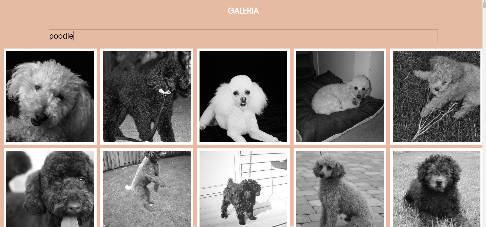

# GALERIA - DS2M

Projeto criado  nas aulas de **PWFE** com objetivo didático para as aulas  do curso de Desenvolvimento de Sistemas do [SENAI JANDIRA](https://jandira.sp.senai.br/), sobre orientação do professor [Fernando Leonid](https://github.com/fernandoleonid). 

